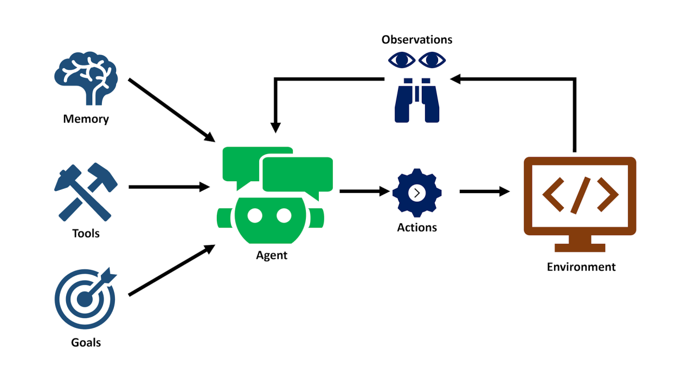

# Agentic AI Playground

Playing with emerging **Agentic AI** frameworks

**What is Agent?**

> AI agents are simply Large Language Models that have been given the ability to interact with the outside world.

## Projects

- **[Vercel AI SDK](./docs/ai-sdk.md)** - A set of Agentic AI code examples using **Vercel AI SDK**
- **[n8n](./docs/n8n.md)** - Running **n8n** workflow automation tool in `docker-compose` with [OrbStack](https://docs.orbstack.dev/docker/domains)
- **[Flowise](https://flowiseai.com/)** - TODO

## Features

- [x] Streaming
- [x] Function Calling
- [x] Structured Outputs
- [ ] Developer Messages
- [ ] Reasoning Models

### What you can build

⭐️ **AI Agents** for scheduling appointments

⭐️ **Summarize Company PDFs** securely without data leaks

⭐️ **Smarter Teams Bots** for enhanced company communications and IT operations

⭐️ **Private Financial Document Analysis** at minimal cost
