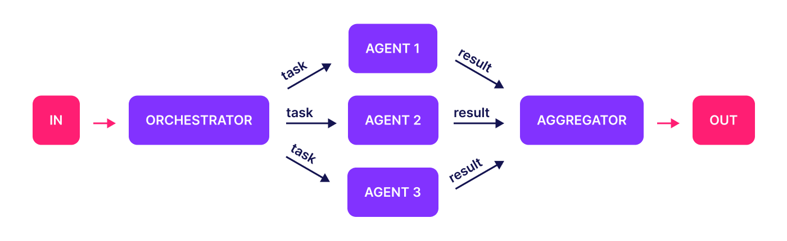

# AI SDK

A set of Agentic AI code examples using **Vercel AI SDK**



## Setup

```shell
pnpm i
```

### Maintenance

```shell
# keep deps up-to-date
pnpm up --latest
```

## Developer Workflow

### Lint

```shell
pnpm run lint
```

### Run

```shell
pnpm run enum
pnpm run array
pnpm run agent
pnpm run evaluator
```

### Build

```shell
pnpm run build
```

## Reference

- AI SDK [Tutorial](https://www.aihero.dev/vercel-ai-sdk-tutorial)
- ai-hero [github repo](https://github.com/ai-hero-dev/ai-hero/)
- simple agent [example](https://www.aihero.dev/agents-with-vercel-ai-sdk?list=vercel-ai-sdk-tutorial)
- Building AI Agent Workflows With Vercel’s AI SDK: [A Practical Guide](https://www.callstack.com/blog/building-ai-agent-workflows-with-vercels-ai-sdk-a-practical-guide)
- [WebAIAgent](https://github.com/jasonmayes/WebAIAgent)
